# Odoo for DocuSign IAM
Learn how to install, configure, and use the Odoo Extension for DocuSign to seamlessly synchronize customer records and agreement data between DocuSign and your Odoo ERP.
## Overview
The Odoo Extension for DocuSign integrates your Odoo ERP database with DocuSign App Center and eSignature workflows. It enables automated record verification, customer lookup, and automated data entry during and after agreement signing.
## How to Install and Configure
### Step 1: Locate the Odoo App in DocuSign App Center
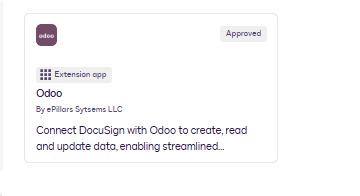 

In your DocuSign account, navigate to **App Center** and search for **Odoo** by ePillars Systems. 

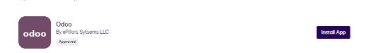

Click **Install App**.
### Step 2: Connect Your Odoo Account
1. Click **Connect Account**. \
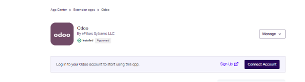
2. Click **Install and Authorize**.
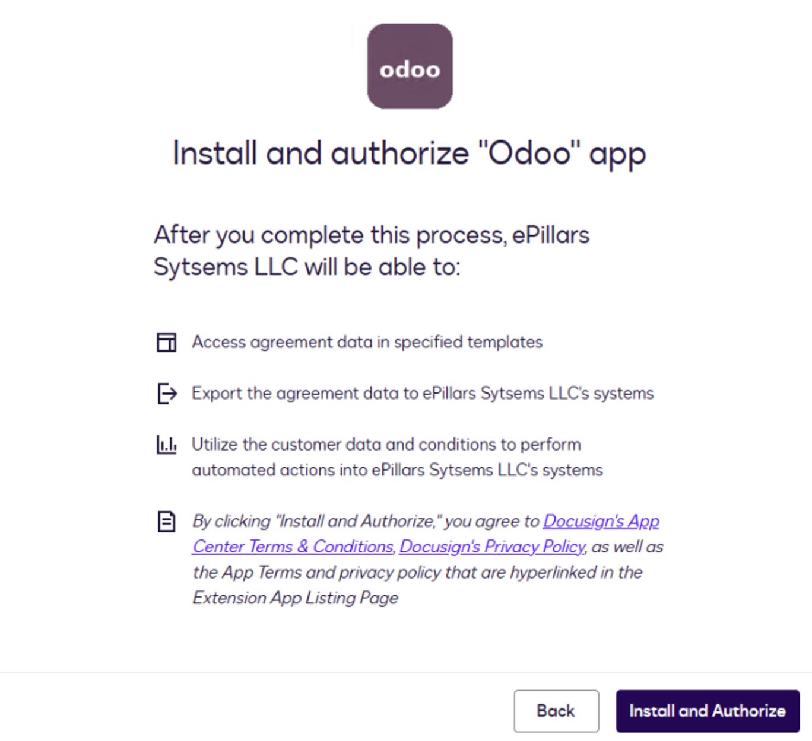
3. Choose **Private** or **Shared** as the connection type, then click **Next**.
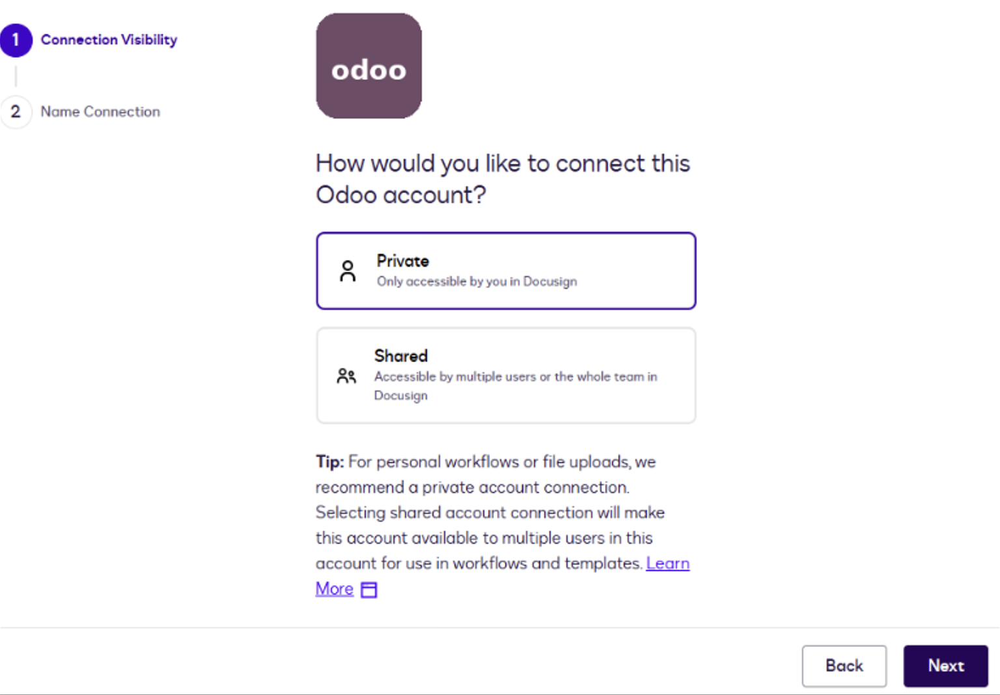
4. Enter a name for the connection and click **Login**.
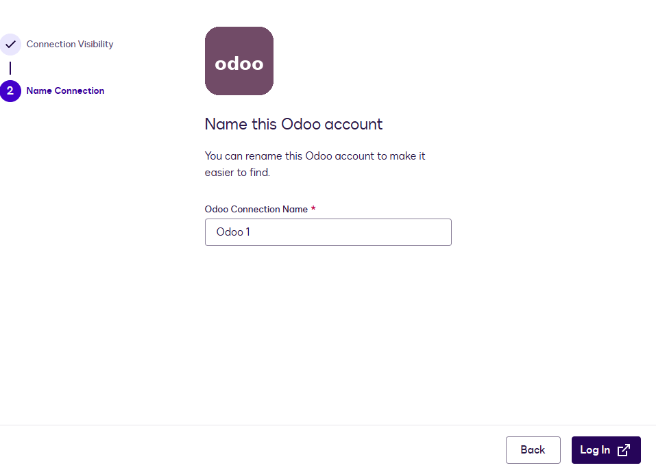
5. On the next page, enter the Odoo instance login details and click **Submit**.
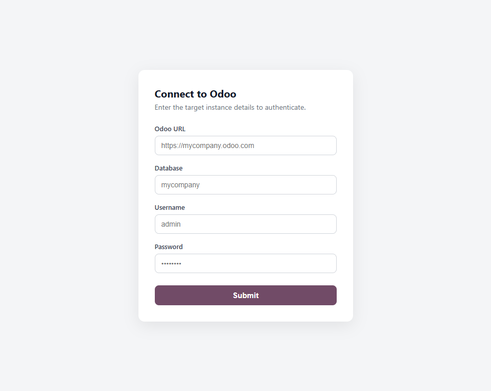
- When prompted to establish a connection, enter your target Odoo server credentials:
- **Odoo Database URL:** Your Odoo instance URL (for example, `https://mycompany.odoo.com`)
- **Database Name:** The target Odoo database name (for example, `mycompany`)
- **Username:** Your Odoo user account email or username
- **Password:** Your Odoo user password or API key
  
### Step 3: Grant User Consent
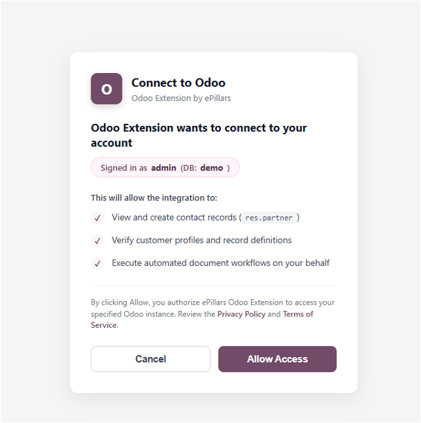
- After submitting your login details, review the requested access permissions on the Odoo OAuth Consent Screen and click **Allow Access** to establish the connection.
## How to Use the App
- In the workflow builder, click **Add Step**, then choose **Read from Odoo** or **Writeback to Odoo** based on the workflow requirement.
### 1. Search and Select Records
- Use the **Read from Odoo** action in DocuSign workflows to query contacts by ID, name, email, or phone number directly from your active Odoo database.
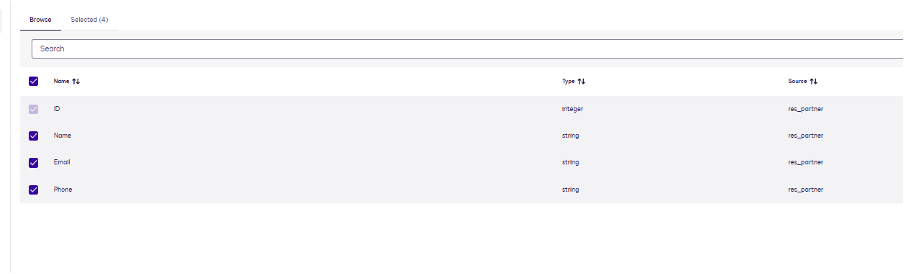
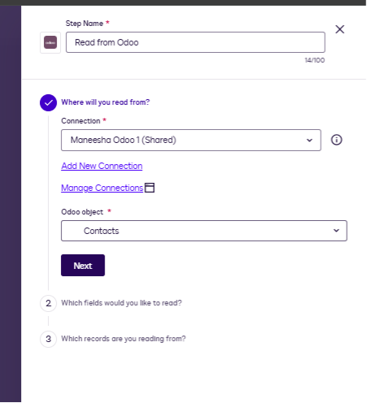
### 2. Create and Update Records
Choose the **Writeback to Odoo** step to create or update customer records in Odoo.
1. Select the connection.
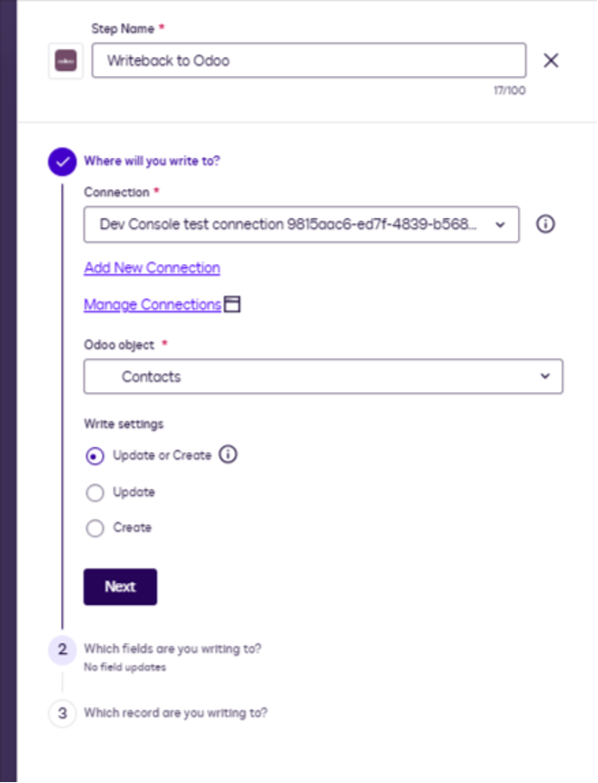
2. Select the fields.
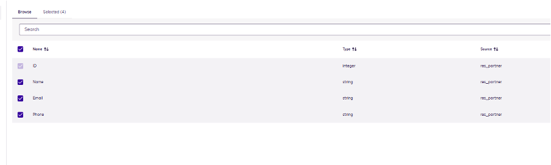
3. Map the fields for the corresponding create or update action.
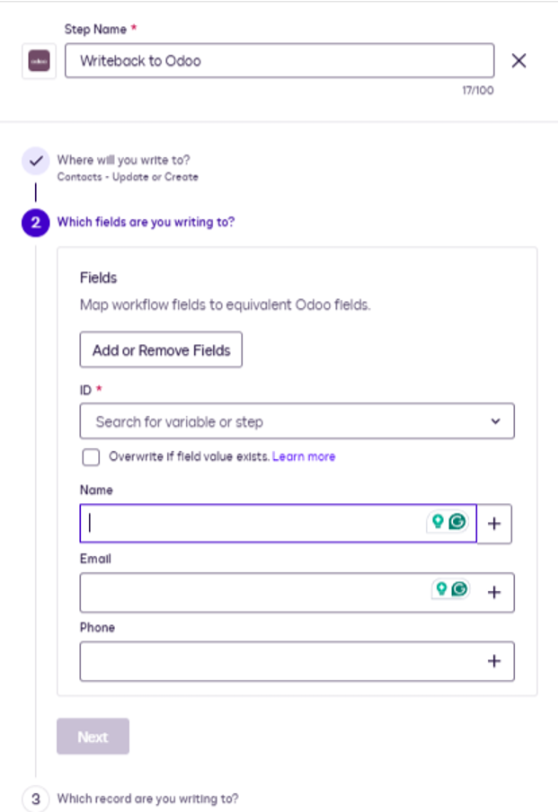
4. Create rules that identify the matching or filtering criteria.
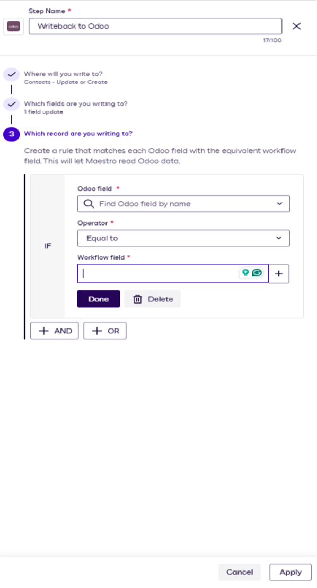
## Frequently Asked Questions
### Do I need an active Odoo subscription?
- Yes, you need access to an active Odoo instance (Community or Enterprise edition, hosted on Odoo.sh, self-hosted, or Odoo Online) with XML-RPC access enabled.
### Is my Odoo password stored by DocuSign?
- No. Passwords are processed securely over encrypted SSL connections to authenticate XML-RPC sessions and generate OAuth access tokens. Your credentials are never shared with third parties.
### What Odoo data models are supported?
- The extension currently supports Contacts and Customers. Support for Sales Orders and Invoices can be enabled upon request.
### How do I revoke access?
- You can disconnect or delete the connection at any time from **DocuSign App Center → Connected Apps**.
## Need Help or Custom Support?
- If you encounter any issues configuring your Odoo connection or require custom workflow integration, please reach out to our team:
- **Email Support:** [support@epillars.com](mailto:support@epillars.com)
- **Contact Portal:** [https://www.epillars.com/contact](https://www.epillars.com/contact)
